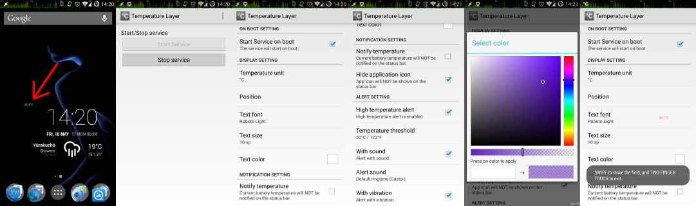

Temperature Layer
=================
[Temperature Layer]はバッテリー温度を表示するだけのシンプルなAndroidアプリケーションです。
ステータスバー上のアイコンやウィジェットとして温度を表示するではなく、画面上に透明なレイヤをかぶせて表示しますので、HOME画面や他のアプリの邪魔になりません。

Temperature Layerは[Google Play]から入手できます。

特徴
----
- Android2.0以降に対応
- バッテリー温度を画面上に透明なレイヤをかぶせて表示
- 端末起動時の自動起動を設定可能
- ステータスバーに温度通知を表示可能
- 単位は摂氏(°C)、華氏(°F)から選択
- 表示位置はスクリーンの四隅から選択(ステータスバーの上にも表示可能)
- デバイスにインストールされているフォントを選択可能
- テキストサイズは6～100sp(scaled-pixel)、テキスト色は透明度も含めて指定可能
- 英語と日本語に対応
- 高温時のアラート機能(通知音、バイブレーション) (ver.1.0.2以降)
- 無料です！

画面キャプチャ
--------------

謝辞
----
このアプリケーションは以下のライブラリを使用しています。それぞれの作者さんに感謝！
- [Android Color Picker]
- [FontPreference dialog for Android] (一部修正版)

リリース履歴
------------
- 2014/05/09 ver.1.0.2 - 高温時のアラート機能を追加
- 2013/07/26 ver.1.0.1 - フォント選択機能を追加
- 2013/06/26 ver.1.0.0 - 正式版リリース
- 2013/06/25 ver.0.9.3 - ステータスバー上にも表示可能に
- 2013/06/24 ver.0.9.2 - 内部構造を改善
- 2013/06/19 ver.0.9.1 - 最初のβ版リリース

ライセンス
----------
Copyright &copy; 2013,2014 Hideyuki SHIMOOKA &lt;shimooka@doyouphp.jp&gt; 
Licensed under the [Apache License, Version 2.0][Apache]

[Apache]: http://www.apache.org/licenses/LICENSE-2.0
[Android Color Picker]: https://code.google.com/p/android-color-picker/
[Temperature Layer]: https://play.google.com/store/apps/details?id=jp.doyouphp.android.temperaturelayer
[Google Play]: https://play.google.com/store/apps/details?id=jp.doyouphp.android.temperaturelayer
[FontPreference dialog for Android]: http://www.ulduzsoft.com/2012/01/fontpreference-dialog-for-android/
