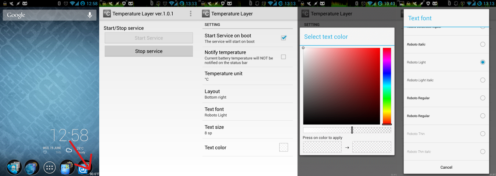

Temperature Layer
=================
[Temperature Layer] is the simple Android application which displays battery temperature. The temperature will be displayed on the transparent layer, so it does not become obstructive.
Temperature Layer is available at [Google Play].

Feature
-------
- Up to Android2.2
- No special permissions require
- The battery temperature will be displayed on the transparent layer
- Automatic start
- Celsius (°C) or Fahrenheit (°F)
- A display position is chosen from the four corners of a screen (on a status bar is possible)
- Customize text size and text color with transparency
- English and Japanese translation
- ... and for FREE !

Screen capture
--------------

Acknowledgement
---------------
This application use [Android Color Picker]. Thanks for yukuku's great works !

Releases
--------
- 2013/06/25 ver.0.9.3 - display on a status bar is possible
- 2013/06/24 ver.0.9.2 - internal refactored
- 2013/06/19 ver.0.9.1 - initial beta release

License
-------
Copyright &copy; 2013 Hideyuki SHIMOOKA &lt;shimooka@doyouphp.jp&gt;
Licensed under the [Apache License, Version 2.0][Apache]

[Apache]: http://www.apache.org/licenses/LICENSE-2.0
[Android Color Picker]: https://code.google.com/p/android-color-picker/
[Temperature Layer]: https://play.google.com/store/apps/details?id=jp.doyouphp.android.temperaturelayer
[Google Play]: https://play.google.com/store/apps/details?id=jp.doyouphp.android.temperaturelayer
